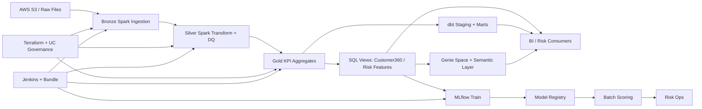

# Databricks Platform Engineering

Interview-ready data platform demo showing how modern teams build and operate analytics and ML workloads on Databricks with cloud integration and CI/CD controls.

## Tech Stack

- Databricks (Spark, SQL, Delta Lake, Unity Catalog)
- AWS integration pattern (S3 -> Bronze Delta)
- dbt on Databricks SQL Warehouse (staging + marts + tests)
- Terraform (IaC for schema, cluster policy, permissions, jobs)
- Jenkins (CI/CD pipeline and quality gates)
- Docker (repeatable local/CI runtime for tests + dbt)
- Kubernetes (optional: scheduled glue jobs like dbt/quality checks, triggering workflows)
- Databricks Asset Bundle (deployment-as-code)
- Delta Live Tables style SQL pipeline
- MLflow MLOps (train, register, batch score)
- Genie/LLM analytics assistant starter

## Architecture At A Glance



## Functional Flow

- **Bronze**: Ingest raw transactions (CSV/S3) to Delta with ingestion timestamp for lineage.
- **Silver**: Standardize schema and enforce quality defaults (currency/status normalization).
- **Gold**: Build customer-level KPIs for analytics and risk use cases.
- **SQL Serving**: Publish analyst-friendly views for BI and downstream feature usage.
- **dbt Layer**: Add analytics-engineering contracts (models, tests, reusable marts).
- **MLOps Layer**: Train with MLflow, register to Unity Catalog registry, batch score features.
- **GenAI Layer**: Use Genie prompt + semantic model for governed natural language analytics.
- **Platform Controls**: Terraform + Unity Catalog grants + cluster policy + job permissions.
- **Delivery Controls**: Jenkins pipeline runs tests and deployment workflow.

## Repository Structure

```text
.
|-- src/
|   |-- jobs/                 # Spark medallion jobs
|   |-- integrations/aws/     # S3 -> Bronze integration starter
|   |-- mlops/                # MLflow train/register/score
|   `-- ai/genie/             # Genie prompt + use cases
|-- dbt/                      # dbt project (staging/marts/tests/seeds)
|-- sql/analytics/            # SQL serving views
|-- dlt/                      # DLT-style SQL pipeline
|-- infra/terraform/          # IaC and governance controls
|-- infra/docker/             # Docker image + compose for repeatable runs
|-- infra/k8s/                # Optional Kubernetes CronJob patterns
|-- jenkins/                  # CI/CD pipeline
|-- config/genie/             # semantic layer starter
|-- scripts/                  # one-command demo helper
|-- sample_data/              # local demo data
`-- docs/                     # architecture + interview notes
```

## Quick Start (Local)

1. Create and activate venv:
   - `python -m venv .venv`
   - `.venv\Scripts\activate`
2. Install dependencies:
   - `pip install -r requirements.txt`
3. Run tests:
   - `pytest -q`

## Deployment Flow (Databricks)

1. Configure Databricks credentials (`DATABRICKS_HOST`, `DATABRICKS_TOKEN`).
2. Provision baseline infra with Terraform in `infra/terraform/`.
3. Deploy jobs via `databricks.yml` and/or Terraform resources.
4. Run CI/CD stages in `jenkins/Jenkinsfile`.
5. Execute medallion jobs in order: bronze -> silver -> gold.
6. Run dbt models/tests and MLOps jobs.

## One-Command Demo

```powershell
.\scripts\demo_run.ps1 -DatabricksHost "<workspace-url>" -DatabricksToken "<token>"
```

## Interview Walkthrough (10-15 min)

- Explain architecture from the Mermaid diagram.
- Show IaC controls in `infra/terraform/`.
- Show Spark medallion implementation in `src/jobs/`.
- Show dbt analytics engineering in `dbt/`.
- Show MLOps lifecycle in `src/mlops/`.
- Show Genie readiness in `src/ai/genie/` and `config/genie/`.
- Show how Docker/K8s fit: containers for consistent tooling; K8s for “platform glue” jobs around Databricks.
- Close with CI/CD and governance story.

## Notes

- This repository is a reference implementation; extend with environment-specific policies and operational runbooks for production.
- Replace placeholders (workspace URL, tokens, IAM/storage config) before real deployment.
- Analytics objects use Unity Catalog schema `main.fintech_platform`. If you previously used another schema name, migrate tables/views or adjust `schema_name` / dbt profile accordingly.
