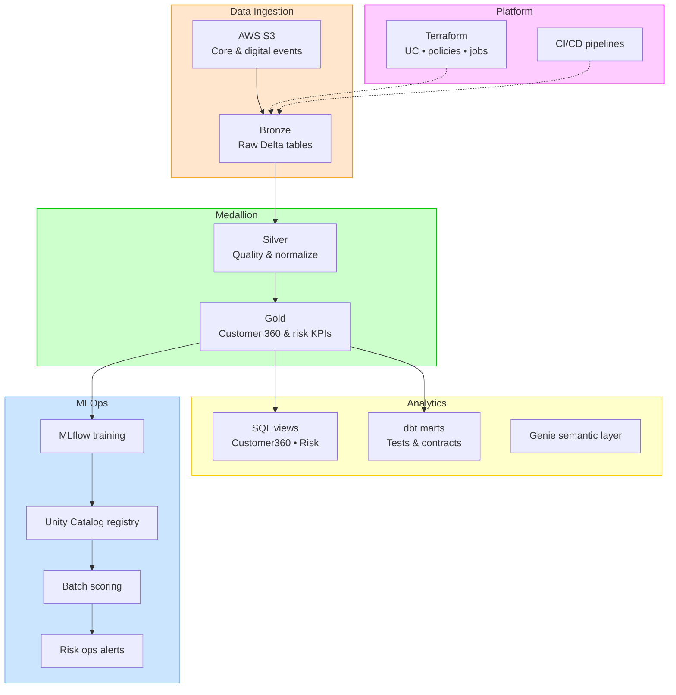

# Tymex Databricks Engineering Platform

> Reference data platform for **Tymex** — a **global digital bank** founded in **South Africa**, scaling cloud-native analytics and ML on **Databricks** (Delta Lake, Unity Catalog, MLOps, Genie).

Portfolio implementation showing how a modern digital bank team ingests core-banking and digital-channel events, governs data in Unity Catalog, and ships analytics/ML with **dbt**, **Terraform**, and **CI/CD**.

## Tech Stack

- Databricks (Spark, SQL, Delta Lake, Unity Catalog)
- AWS integration (S3 → Bronze Delta)
- dbt on Databricks SQL Warehouse (staging + marts + tests)
- Terraform (schema, cluster policy, permissions, jobs)
- Jenkins / GitHub Actions (quality gates)
- Docker & optional Kubernetes (scheduled dbt / workflow triggers)
- Databricks Asset Bundles
- Delta Live Tables–style SQL pipelines
- MLflow MLOps (train, register, batch score)
- Genie / LLM analytics assistant starter

## Architecture At A Glance



## Functional Flow

- **Bronze**: Ingest transactions and customer events from S3 with lineage timestamps.
- **Silver**: Schema normalization, currency/status rules, data quality defaults.
- **Gold**: Customer-level KPIs for digital banking analytics and risk features.
- **dbt**: Analytics engineering contracts (staging, marts, tests).
- **MLOps**: MLflow train → Unity Catalog register → batch score.
- **Genie**: Governed natural-language analytics over `main.tymex_platform`.
- **Controls**: Terraform + Unity Catalog grants + cluster policies + Jenkins/GitHub CI.

## Repository Structure

```
.
├── src/jobs/                 # Spark medallion jobs
├── src/integrations/aws/   # S3 → Bronze
├── src/mlops/                # MLflow lifecycle
├── src/ai/genie/             # Genie prompts
├── dbt/                      # dbt project
├── sql/analytics/            # Serving views
├── infra/terraform/          # IaC & governance
├── jenkins/                  # CI/CD
└── docs/                     # Architecture & interview notes
```

## Quick Start (Local)

```bash
python -m venv .venv
.venv\Scripts\activate
pip install -r requirements.txt
pytest -q
```

## Deployment (Databricks)

1. Set `DATABRICKS_HOST`, `DATABRICKS_TOKEN`.
2. Apply Terraform in `infra/terraform/`.
3. Deploy bundles via `databricks.yml`.
4. Run jobs: bronze → silver → gold → dbt → MLOps.

## One-Command Demo

```powershell
.\scripts\demo_run.ps1 -DatabricksHost "<workspace-url>" -DatabricksToken "<token>"
```

## Notes

- Unity Catalog schema: `main.tymex_platform` (formerly `tymex_platform` in early drafts).
- Portfolio/demo repo — replace workspace URLs, tokens, and IAM paths before production use.

**Will Tran** — [@willtran112358](https://github.com/willtran112358)
